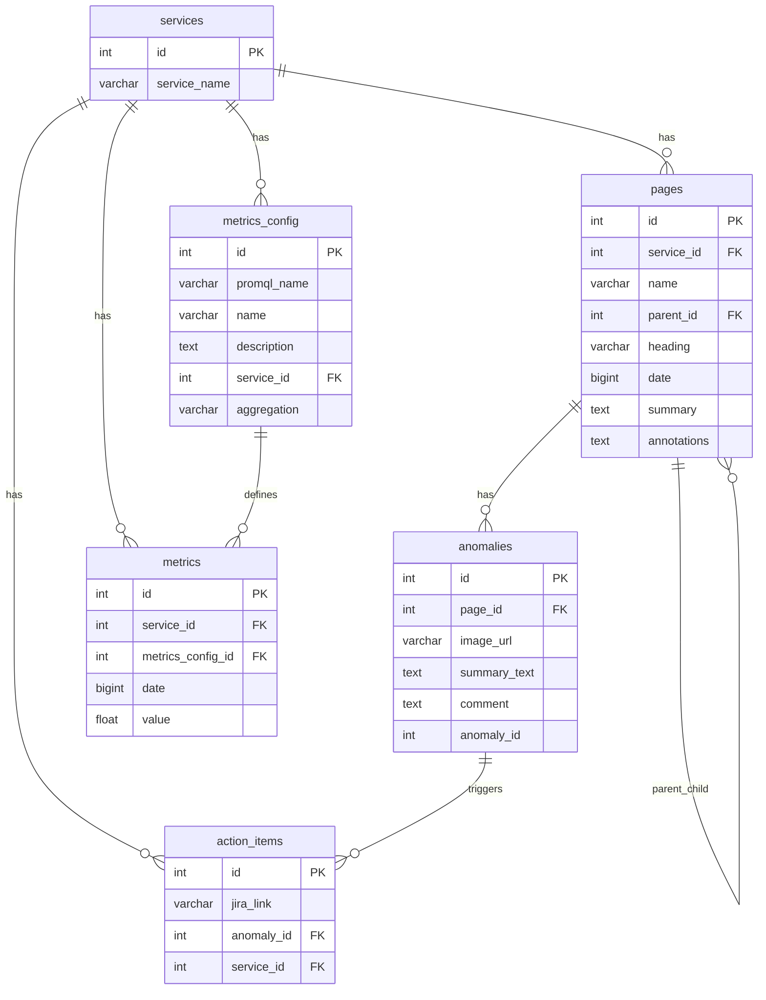
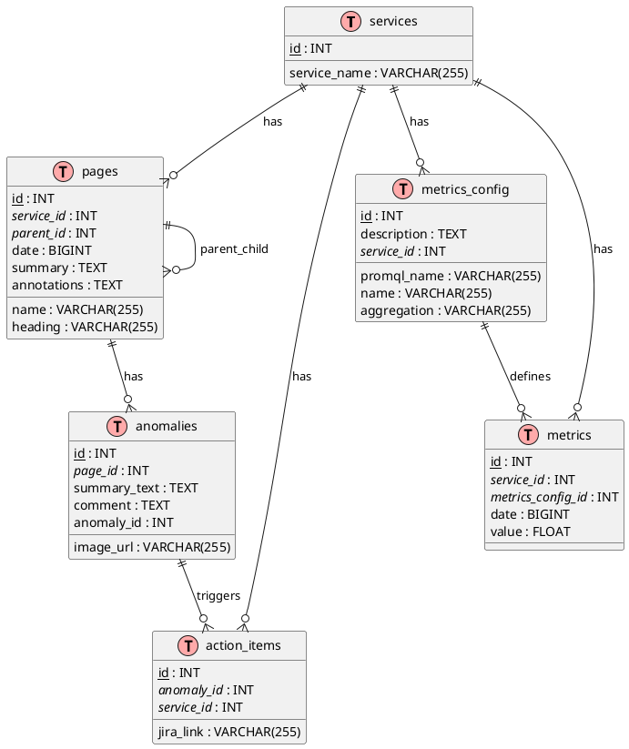

# Database Schema Diagram

## Mermaid ERD (Entity Relationship Diagram)



## Alternative: PlantUML Database Diagram



## How to Visualize

### Option 1: Mermaid Live Editor
1. Go to [Mermaid Live Editor](https://mermaid.live/)
2. Copy the Mermaid code (between the ```mermaid tags)
3. Paste it in the editor
4. The diagram will render automatically

### Option 2: GitHub
1. Create a new markdown file in your GitHub repository
2. Copy the Mermaid code
3. GitHub will automatically render the diagram

### Option 3: PlantUML Online
1. Go to [PlantUML Online Server](http://www.plantuml.com/plantuml/uml/)
2. Copy the PlantUML code (between @startuml and @enduml)
3. Paste and view the diagram

### Option 4: Draw.io (diagrams.net)
1. Go to [draw.io](https://app.diagrams.net/)
2. Create a new diagram
3. Use the database template to manually recreate the schema

## Database Schema Summary

This schema represents a monitoring/observability system with:

- **Services**: The main entities being monitored
- **Pages**: Hierarchical pages associated with services
- **Anomalies**: Issues detected on pages
- **Action Items**: JIRA tickets linked to anomalies
- **Metrics Config**: Configuration for different metrics
- **Metrics**: Actual metric values over time

The relationships show a typical monitoring system where services have pages, pages can have anomalies, anomalies trigger action items, and metrics are collected based on configurations. 